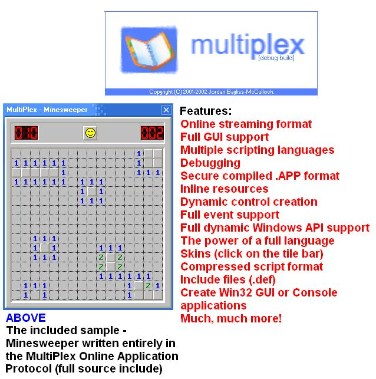



## MultiPlex Online Application Protocol v3\.0

### Description

This is the third release of the hugely successfull MultiPlex Online

Application Protocol. It allows users to stream specially created OAP

applications over any TCP/IP connection using HTTP as it's transport.

MultiPlex is a scripting interface that I designed a year ago. It allows

uses to create applications using many languages mixed together, eg:

JavaScript and VBScript in the same application. With the introduction of

version 3 come many new features. Now the scripts can be compiled into

complete applications with full GUI features - dialogs, buttons, labels,

timers - anything. If you can make a program in VB you can make it in

MultiPlex. The script also has full access to the Windows API and is able to

call any function it defines. Version 3 also allows the user to create and

changes skins that an application may use. To show the power of MultiPlex I

have included a sample program (Minesweeper, from a sample on PSC). This

also demonstrates another feature of MultiPlex - events. In the future I

intend to make MultiPlex into an online setup program...a very powerful one.

The best way to see how it works is to download it and see. I was unable to

find a good web host to use to emonstrate the streaming features, so when

the message box appears please press No and open the Minesweeper sample. I

believe that this is very useful code - if you do and you are impressed,

please vote. There are so many leaches out there that take code, use it, and

don't even think about the work that went into it...Anyway - enjoy!!!
 
### More Info
 

             |
---                |---
**Submitted On**   |2002-12-27 14:27:44
**By**             |[jbay101](https://github.com/Planet-Source-Code/PSCIndex/blob/master/ByAuthor/jbay101.md)
**Level**          |Intermediate
**User Rating**    |4.9 (141 globes from 29 users)
**Compatibility**  |VB 5\.0, VB 6\.0
**Category**       |[Complete Applications](https://github.com/Planet-Source-Code/PSCIndex/blob/master/ByCategory/complete-applications__1-27.md)
**World**          |[Visual Basic](https://github.com/Planet-Source-Code/PSCIndex/blob/master/ByWorld/visual-basic.md)
**Archive File**   |[MultiPlex\_152162112003\.zip](https://github.com/Planet-Source-Code/jbay101-multiplex-online-application-protocol-v3-0__1-42060/archive/master.zip)

